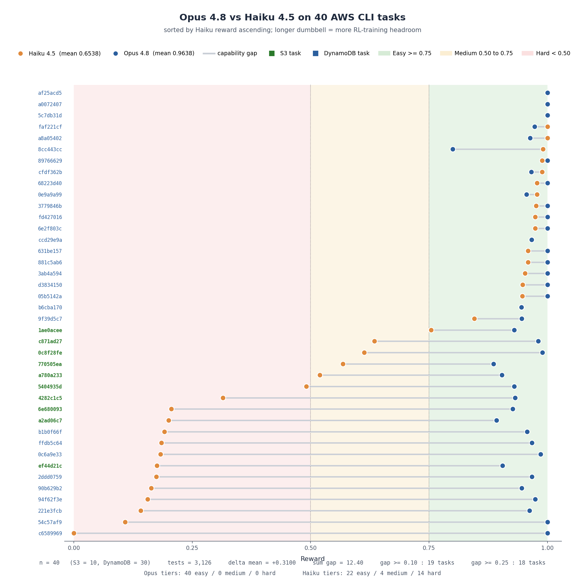

# Raiden Samples: AWS CLI

> **Agentic-coding RL environments in Harbor format · 40 tasks ·
> 3 404 held-out tests · offline-by-construction service simulation ·
> scalar reward in `[0, 1]`**
 


**Raiden** is a set of reinforcement-learning training environments for
agentic code generation. Each task drops a coding agent into a
containerized workspace, hands it a prose spec, hides the test suite,
and grades the resulting submission on the fraction of E2E tests that
pass. All tasks ship in the
[Harbor](https://github.com/harbor-framework/harbor) format so any
Harbor-compatible runner can drive them without adaptation.

This repository holds **two scoped pilot deliveries**, one per AWS
CLI service family. They share the same envelope, grader, and agent
contract; they differ only in the CLI surface under test, the
simulation backend, and the calibration numbers.

## Table of contents

- [Deliveries at a glance](#deliveries-at-a-glance)
- [Repository layout](#repository-layout)
- [Motivation & intended use](#motivation--intended-use)
- [What Raiden is](#what-raiden-is)
- [Shared contract (both deliveries)](#shared-contract-both-deliveries)
- [Scope of the deliveries](#scope-of-the-deliveries)
  - [S3 scope: 10 tasks](#s3-scope-10-tasks)
  - [DynamoDB scope: 30 tasks](#dynamodb-scope-30-tasks)
- [Methodology & reward design](#methodology--reward-design)
- [How grading works](#how-grading-works)
- [Quality posture](#quality-posture)
- [Model calibration](#model-calibration)
  - [S3 calibration](#s3-calibration)
  - [DynamoDB calibration](#dynamodb-calibration)
- [`task.toml` quick reference](#tasktoml-quick-reference)
- [Reproducing a single task locally](#reproducing-a-single-task-locally)
- [Reproducibility & provenance](#reproducibility--provenance)
- [Versioning, licensing & citation](#versioning-licensing--citation)
- [Design notes](#design-notes)

---

## Deliveries at a glance

| Delivery scope       | Tasks | Held-out tests | Simulation backend       | Opus 4.8 mean | Haiku 4.5 mean | Mean gap |
| -------------------- | ----: | -------------: | ------------------------ | ------------: | -------------: | -------: |
| `aws s3` CLI         |    10 |            626 | MinIO (session-scoped)   |        0.9276 |         0.4477 |  +0.4799 |
| `aws dynamodb` CLI   |    30 |          2 778 | DynamoDB Local sidecar   |        0.9759 |         0.7225 |  +0.2534 |
| **Combined**         |    40 |          3 404 | - | - | - | - |

Per-task calibration chart (all 40 tasks in one figure, sorted by Opus
reward ascending; task labels are colored by scope, green for S3, blue
for DynamoDB):

- [`opus_vs_haiku.png`](./opus_vs_haiku.png)

Both deliveries live side-by-side under the same flat `dataset/` and
`trajectories/` folders, see [Repository layout](#repository-layout).
Which service a given task belongs to is recorded in its
`task.toml.metadata.keywords` (`aws_cli_s3` vs `aws_cli_dynamodb`) and in
its `task.toml.metadata.commands` list.

## Repository layout

```
raiden-samples/
├── README.md                     # this file - covers both deliveries end-to-end
├── LICENSE                       # MIT (Ethara.AI 2026), covers the whole repo
├── REQUIREMENTS.md               # the pilot requirements this repo satisfies
├── opus_vs_haiku.png             # combined per-task reward chart, all 40 tasks (10 S3 + 30 DynamoDB)
├── dataset/                      # 40 Harbor-format tasks (UUID-named dirs), 10 S3 + 30 DynamoDB
│   └── <task-uuid>/
│       ├── instruction.md        # the spec the model sees
│       ├── environment/
│       │   ├── Dockerfile        # builds the task container
│       │   └── docker-compose.yaml # boots the simulation-backend sidecar (MinIO or DynamoDB Local)
│       ├── tests/
│       │   ├── __init__.py       # marks tests/ as a package for pytest collection
│       │   ├── _s3_http.py / _ddb_http.py # stdlib-only wire-protocol client for the fixtures
│       │   ├── conftest.py       # anti-NOP guard, `cli` fixture, backend-reset autouse fixture
│       │   ├── test.sh           # entrypoint: runs pytest, writes reward
│       │   └── test_<...>.py     # per-command and cross-command E2E tests (hidden from the agent)
│       ├── solution/
│       │   ├── reference.diff    # reference solution as a git patch
│       │   ├── golden.diff       # golden solution as a git patch
│       │   └── solve.sh          # applies the selected patch and wires up submission/aws
│       └── task.toml             # Harbor task metadata (scope = keywords + commands)
└── trajectories/
    ├── claude-opus-4-8/          # 40 pass@1 candidate-model trials (10 S3 + 30 DynamoDB)
    │   └── <task-uuid>/
    └── claude-haiku-4-5/         # 40 pass@1 weaker-model calibration trials (10 S3 + 30 DynamoDB)
        └── <task-uuid>/
```

The service scope of a given task is not encoded in the directory path
, it is recorded inside each `task.toml`:

- **S3 tasks** carry `"aws_cli_s3"` in `metadata.keywords` and their
  `metadata.commands` are drawn from `{mb, rb, cp, ls, mv, rm, sync}`.
- **DynamoDB tasks** carry `"aws_cli_dynamodb"` in `metadata.keywords`
  and their `metadata.commands` are drawn from
  `{create-table, delete-item, delete-table, get-item, list-tables, put-item, query, update-item}`.

A one-liner to list them:

```bash
# S3 task UUIDs
grep -l aws_cli_s3 dataset/*/task.toml | xargs -n1 dirname | xargs -n1 basename

# DynamoDB task UUIDs
grep -l aws_cli_dynamodb dataset/*/task.toml | xargs -n1 dirname | xargs -n1 basename
```

---

## Motivation & intended use

**Why this exists.** Static coding benchmarks (function-completion,
single-file bug-fix) saturate quickly and reward pattern-matching against
visible tests. Raiden targets the harder regime: an agent must build a
*stateful CLI application* from a prose spec, in a container, with the
grader hidden. Both AWS CLI surfaces we ship (`aws s3` and
`aws dynamodb`) are deliberate choices, they are stateful, they have a
rich error-and-exit-code contract, and their wire semantics
(S3 REST + XML for one, DynamoDB-JSON typed-attribute wire format
plus condition-expression / query key-condition grammar for the
other) are non-trivial to get right, so the tasks reward genuine
implementation rather than recall.

**Primary intended use.** A *reinforcement-learning reward source* for
training and evaluating agentic code-generation models. The consumer
runs their model on each task and uses `passed / total` as a scalar
reward.

**Also suitable for.**

- **Offline evaluation** of an agent's ability to satisfy a real CLI
  contract without seeing the grader.
- **Ablations** on agent scaffolds, prompting, or reasoning budgets,
  holding the environment fixed.
- **A template** for authoring new stateful-CLI environments, the
  Harbor envelope, grader, and runner contract are reusable across
  services (see [Design notes](#design-notes)).

**Out of scope / not designed for.**

- **A leaderboard-grade benchmark as-is.** These are *sample
  deliveries* of the task environments, they ship the tasks and
  grader, not any scores.
- **Fidelity to every AWS behavior.** Only the in-scope command
  surfaces are exercised, and only to the extent the shipped
  simulation backends emulate them; streams, global tables, PITR,
  multi-region replication, S3 replication, KMS-integrated encryption,
  server-access logging, and other out-of-scope AWS behaviors are
  explicitly out of scope.

**Audience.** ML researchers and engineers building or evaluating
agentic code models, and authors extending Raiden to new CLI surfaces.

---

## What Raiden is

Raiden produces training data for agentic code models. Each task in
either delivery is a self-contained job in the Harbor format: a
containerized workspace, a spec, a hidden test suite, and a reference
solution. The consumer runs the tasks against their model and uses the
resulting pass rate as a reward signal.

The contract a model faces, per task, when the consumer runs it:

1. The model is dropped into a containerized workspace and given an
   `instruction.md`, a spec describing the application it must build.
2. The model writes the application from scratch (source files, entry
   points, anything it needs). It does **not** see any test code.
3. A held-out test suite is executed against the model's submission.
   The fraction of tests that pass becomes a scalar reward in
   `[0, 1]`, suitable for use as a reinforcement-learning reward signal.

The tests are the ground truth for "did the model actually build the
thing it was asked for". Because the model never sees them during
generation, it must solve the spec on the merits, not pattern-match
against the grader.

---

## Shared contract (both deliveries)

Both deliveries were produced from the same pipeline and share the
same runtime and grading contract. Anything below applies uniformly to
all 40 tasks.

### The agent's contract, inside the container

- **Workspace root:** `/workspace`
- **Submission location:** the submission is exposed as an `aws`
  executable on `$PATH`. The `Dockerfile` creates `/workspace/submission/`
  and puts it first on `PATH`, so the harness's
  `["/workspace/submission/aws", <cli>, ...]` invocation resolves to
  whatever the agent placed there. The submission is
  **language-agnostic**: the agent may write any files it wants under
  `/workspace/submission/` and in any language, as long as
  `/workspace/submission/aws` ends up as a runnable executable (a
  native binary, a script with a shebang, or a wrapper that dispatches
  to whatever it wants underneath).
- **Invocation:** the test harness calls
  `aws <cli> <command> [args...]` as a subprocess for every test
  (`aws s3 ...` in the S3 delivery, `aws dynamodb ...` in the
  DynamoDB delivery).
- **AWS credentials and endpoint.** `AWS_ACCESS_KEY_ID=raidentest`,
  `AWS_SECRET_ACCESS_KEY=raidentest`, and
  `AWS_DEFAULT_REGION=us-east-1` are baked into every image. Each
  delivery's `docker-compose.yaml` brings up its simulation sidecar
  (MinIO for S3 on a loopback port, DynamoDB Local for DynamoDB as the
  `ddb` service on port 8000) and injects the appropriate
  service-scoped endpoint via env
  (`AWS_ENDPOINT_URL_S3` / `AWS_ENDPOINT_URL_DYNAMODB` plus the
  catch-all `AWS_ENDPOINT_URL`). Submissions must not override
  credentials, region, or endpoints in code.
- **State reset.** An autouse fixture in `tests/conftest.py` wipes the
  simulation-backend state (drops all buckets / drops all tables)
  before and after every test, so cases are independent.
- **Reward sink:** `/logs/verifier/reward.txt`, a float in `[0, 1]`
  equal to `passed / total`, written by `tests/test.sh`.
- **Anti-NOP guard (uniform across all 40 tasks).**
  `tests/conftest.py::pytest_configure` calls
  `pytest.exit(returncode=1, …)` before any test collects if
  `/workspace/submission/aws` is absent, a missing submission scores
  exactly `0.0`, and the parser in `test.sh` writes `reward=0.0` in
  that case because no JUnit XML is produced. The
  `error-invalid-args` behaviour class asserts `returncode != 0`
  (any non-zero code from the documented per-scope contract is
  accepted), so a stub that merely `exit 0`s on every invocation
  still fails the entire invalid-args block.

### Runtime scaffold

- **Format.** [Harbor 0.13.1](https://github.com/harbor-framework/harbor)
  task envelope: `instruction.md` +
  `environment/{Dockerfile, docker-compose.yaml}` + `tests/` +
  `solution/{reference.diff, golden.diff, solve.sh}` + `task.toml`.
- **Agent scaffold** used to produce the shipped trajectories:
  `openhands-sdk v1.12.0` (pinned by immutable release tag) under
  Harbor 0.13.1, `n_attempts=1` (pass@1), `n_concurrent_trials=4`,
  `max_iterations=1000`, `force_adaptive_thinking=true`,
  `LLM_REASONING_EFFORT=high`.

---

## Scope of the deliveries

### S3 scope: 10 tasks

Every task asks the agent to implement a subset of `aws s3` commands
drawn from the full set `{mb, rb, cp, ls, mv, rm, sync}` (7 commands).
The subset sizes in this delivery are concentrated around 4 – 5
commands per task.

Each task ships a focused test suite covering happy paths, error cases,
edge cases, and **cross-command workflow tests** that verify state
stays consistent across operations (e.g. `mb` → `cp` local→S3 → `ls`
finds the object → `cp` S3→local round-trips identical content).

| Metric                  | Min | Max | Average | Total |
| ----------------------- | --- | --- | ------- | ----- |
| Tests per task          | 44  | 84  | ~63     | 626   |

Behaviour-tag classes for S3: `happy_path` / `error` / `edge` /
`workflow`. S3 itself is simulated by a per-session
[MinIO](https://min.io/) server booted from `tests/conftest.py`, no
real AWS account, no network egress, fully deterministic, fully
offline.

### DynamoDB scope: 30 tasks

Every task asks the agent to implement a subset of `aws dynamodb`
commands drawn from the full set
`{create-table, delete-item, delete-table, get-item, list-tables, put-item, query, update-item}`
(8 commands). The subset sizes are concentrated around 6 – 7 commands:

| Commands per task | 5 | 6  | 7  | 8 |
| ----------------- | - | -- | -- | - |
| Number of tasks   | 4 | 14 | 10 | 2 |

Each task ships a focused test suite covering happy paths,
invalid-args errors, nonexistent-resource errors, edge cases, and
**cross-command workflow tests** that verify state stays consistent
across operations (e.g. `create-table` → `put-item` → `query` →
`delete-item` → `get-item` returns no `Item`). All 30 tasks ship
multiple workflow tests.

| Metric                  | Min | Max | Average | Total  |
| ----------------------- | --- | --- | ------- | ------ |
| Tests per task          | 71  | 120 | ~93     | 2 778  |
| Workflow tests per task | 6   | 12  | ~11.1   | 332    |

Behaviour-tag classes for DynamoDB: `happy_path` /
`error_invalid_args` / `error_nonexistent` / `edge` / `workflow`.
DynamoDB itself is simulated inside the container by
[`amazon/dynamodb-local:2.5.4`](https://hub.docker.com/r/amazon/dynamodb-local)
running as a compose sidecar (`-inMemory -sharedDb -port 8000`), no
real AWS account, no network egress, fully deterministic, fully
offline.

### Side-by-side scope comparison

| Aspect                              | S3 scope                                                              | DynamoDB scope                                                                                                    |
| ----------------------------------- | --------------------------------------------------------------------- | ----------------------------------------------------------------------------------------------------------------- |
| Full command set                    | `{mb, rb, cp, ls, mv, rm, sync}` (7)                                  | `{create-table, delete-item, delete-table, get-item, list-tables, put-item, query, update-item}` (8)              |
| Simulation backend                  | [MinIO](https://min.io/) (session-scoped, spawned by `conftest.py`)   | `amazon/dynamodb-local:2.5.4` sidecar via compose (`sha256`-pinned)                                               |
| Wire-protocol test client           | `_s3_http.py` (stdlib-only S3 REST client)                             | `_ddb_http.py` (stdlib-only DynamoDB JSON client)                                                                 |
| Endpoint env                        | `AWS_ENDPOINT_URL_S3` (+ `AWS_ENDPOINT_URL`)                          | `AWS_ENDPOINT_URL_DYNAMODB=http://ddb:8000` (+ `AWS_ENDPOINT_URL`)                                                |
| Behaviour-tag classes               | 4 (`happy_path` / `error` / `edge` / `workflow`)                      | 5 (`happy_path` / `error_invalid_args` / `error_nonexistent` / `edge` / `workflow`)                                |
| Per-task test counts                | 44 – 84 (avg ~63)                                                     | 71 – 120 (avg ~93)                                                                                                |
| Exit-code contract (per spec)       | Any non-zero on error (usage-error `{2, 252, 255}` acceptable)         | Single closed set `{0, 1, 252, 254, 255}` documented in every `instruction.md`                                    |

---

## Methodology & reward design

### Reward construction

The reward is intentionally the simplest signal that is dense and
monotone in capability: the **fraction of held-out tests that pass**,
`reward = passed / total ∈ [0, 1]`. There is no partial credit within
a test, no weighting across tests, and no exit-code shortcut, the
scalar is computed only from pytest outcomes. This keeps the signal
interpretable (a `0.05` gain is "≈5% more of the suite") and trivially
comparable across attempts on the same task.

**Why per-test fraction rather than all-or-nothing.** Agentic coding
is partial by nature: a policy may get `create-table` /
`list-tables` / `put-item` right but botch `query`'s key-condition
grammar (DynamoDB), or nail `mb` / `cp` / `ls` but miss the
`--recursive` semantics of `rm` (S3). A binary "all tests pass"
reward would be near-zero for every realistic rollout early in
training and would carry almost no gradient. The fractional reward
exposes which behaviors are already solved and turns the suite into a
dense curriculum.

**Reward granularity is a function of test composition.** Because
every test contributes `1/total`, the distribution of tests across
behaviors directly sets the reward's sensitivity. In DynamoDB the
happy-path block dominates the denominator (~52% of tests on average),
while the error and edge blocks are compressed to a small set of
boundary cases (missing table, schema-mismatched key, oversized
string / attribute-set, condition-check failure) so a single code
path cannot swing the reward disproportionately. S3 has a similar
composition, adjusted for the different behaviour-tag taxonomy.

### Discrimination

Each task is constructed to separate strong from weak policies:

- **Floor.** All 40 tasks have an effective empty-submission floor of
  `0.0` for naive empty / missing / non-executable stubs, enforced by
  the conftest-level anti-NOP guard (which aborts pytest before any
  test collects and produces no JUnit XML, so the `test.sh` parser
  writes `reward=0.0`).
- **Ceiling.** The reference solution (`solution/reference.diff`)
  passes the full suite on every task, so `1.0` is attainable in
  principle.
- **Spread.** Between these bounds the suite grades partial progress
  smoothly, so a policy's reward tracks how much of the CLI contract
  it actually satisfies, the tasks are neither trivially passed nor
  impossible.

### Anti-gaming design

The agent never sees test code during generation, so it cannot
overfit the grader; it must satisfy the underlying service semantics
on the merits. The contract is enforced through a real subprocess
invocation (`aws <cli> <command> …`) against a live simulation
backend (MinIO or DynamoDB Local), so the submission is graded on
observable behavior (stdout, stderr, exit code, and resulting
bucket / object / table / item state read back via the raw HTTP
client) rather than on internal structure.

---

## How grading works

`tests/test.sh` is the single E2E entrypoint per task. It:

1. Runs the full pytest suite under `tests/` with `-p no:randomly` so
   test order is deterministic, captures human-readable output to
   `/logs/verifier/pytest_output.log`, and emits a structured JUnit
   XML report to `/logs/verifier/results.xml` via pytest's built-in
   `--junit-xml` flag.
2. Computes counts (`tests`, `failures`, `errors`, `skipped`) from
   the JUnit XML via Python stdlib `xml.etree.ElementTree`, and
   cross-checks the collected count against
   `task.toml.tests_shipped`. If a collection error silently drops
   tests on the floor (`collected < tests_shipped`), the parser
   refuses to grade and writes `reward = 0.0` with a clear diagnostic
   on stderr.
3. Computes `reward = round(passed / (passed + failures + errors), 4)`,
   intentionally excluding `skipped` / `xfail` / `deselected` from
   the denominator so they neither help nor hurt the score.
4. Writes that reward to `/logs/verifier/reward.txt` and echoes a
   one-line summary (`reward=… parser=v2`) to stdout.
5. Always exits `0`, regardless of pass/fail count, the reward file
   is the grading channel, not the exit code.

The full pytest stdout is preserved at
`/logs/verifier/pytest_output.log` inside the container alongside the
JUnit XML report.

---

## Quality posture

Every task in both deliveries satisfies:

- **Discriminative reward.** The reference solution under
  `solution/reference.diff` passes the full test suite. Across all 40
  tasks a naive empty / missing / non-executable stub scores exactly
  `0.0` because the conftest-level anti-NOP guard aborts pytest before
  any test collects, so no JUnit XML is produced and the `test.sh`
  parser writes `reward=0.0`. Each `task.toml` carries
  `discriminative = true`.
- **Feature coverage.** Tests exercise every command in the task's
  subset across the delivery's behaviour-tag classes plus
  cross-command workflows. The per-task counts in
  `task.toml[metadata.behaviour_tag_counts]` show the split.
- **State-persistence coverage.** Every task ships multiple workflow
  tests asserting cross-command state, S3: `mb` → `cp` → `ls` →
  `cp back` round-trips identical content; DynamoDB: `create-table`
  → `put-item` → `query` → `delete-item` → `get-item` returns no
  `Item`.
- **Hermetic execution.** No real AWS, no internet, no flaky
  time-dependent paths. The `docker-compose.yaml` under each
  `environment/` pins ~30 external hostnames (`pypi.org`,
  `github.com`, `s3.amazonaws.com`, `dynamodb.amazonaws.com`,
  package mirrors, …) to `0.0.0.0` at the container level, and
  `tests/conftest.py` installs a `socket.connect` guard that raises
  on any connect to a non-loopback / non-private IP or to a known
  package-index / cloud-CLI hostname. `PYTHONHASHSEED=0`, `TZ=UTC`,
  and `LC_ALL=C.UTF-8` are baked into every image. The DynamoDB
  Local sidecar is pinned by `sha256` digest and runs
  `-inMemory -sharedDb` for deterministic startup and no on-disk
  state leakage.
- **Container reliability.** Each `environment/Dockerfile` builds
  from a pinned base image (S3:
  `aws_cli_s3` `sha256`-pinned in ECR; DynamoDB:
  `426628337772.dkr.ecr.ap-south-1.amazonaws.com/aws_cli_dynamodb@sha256:9ca8d49449e64b5226138ff660ba8c9bbc52c0c8490b9b0fd01f7a95d5d107f2`)
  on a fresh machine with no extra inputs; the image is
  implementation-agnostic and puts `/workspace/submission/` on
  `$PATH`, accepting whatever `aws` executable the agent writes
  there.
- **Deterministic grading.** `test.sh` runs pytest with randomization
  disabled and reduces output to a single scalar reward written to
  `/logs/verifier/reward.txt`. The autouse fixture wipes
  simulation-backend state before every test so state never leaks
  across cases.
- **Upstream validation.** The reference solutions were
  sanity-checked against the real upstream `aws s3` / `aws dynamodb`
  CLIs, the shipped specs are compatible with the observable
  behaviour of the upstream tools on the in-scope command surfaces.
  For DynamoDB the exit-code contract, documented in every
  `instruction.md`, is a single closed set, `{0, 1, 252, 254, 255}`
 , where `0` is success, `1` is an application error, `252` is a
  parameter / usage error, `254` is a service-modeled error
  (`ResourceNotFoundException` / `ConditionalCheckFailedException`
  / `ValidationException`), and `255` is any other or general error.
  Tests assert `returncode != 0` on error paths so any non-zero code
  in the documented set is acceptable.

---

## Model calibration

To validate that each suite discriminates cleanly across capability
tiers, two Anthropic models were run end-to-end against every task in
both deliveries, the strong **candidate model**
(**Claude Opus 4.8**) and a deliberately **weaker calibration model**
(**Claude Haiku 4.5**), under the `openhands-sdk v1.12.0` /
`harbor 0.13.1` scaffold, with `max_iterations = 1000` and
`LLM_REASONING_EFFORT=high` (`force_adaptive_thinking=true`). Reward
is the same scalar every consumer sees: `passed / total ∈ [0, 1]`
written to `/logs/verifier/reward.txt`. The two-model design lets the
candidate reward bound the ceiling while the weaker-model reward
surfaces the intra-suite difficulty gradient.

Trajectories for both models on both deliveries ship under
`trajectories/claude-{opus-4-8,haiku-4-5}/<task-uuid>/`; each trial
dir carries the full runtime evidence (agent log, verifier reward,
JUnit XML, trial config). The 10 S3 UUIDs and 30 DynamoDB UUIDs are
mutually disjoint, so `trajectories/claude-opus-4-8/` mixes all 40
tasks and the scope of each is resolved by reading the corresponding
`dataset/<uuid>/task.toml`.



Difficulty tiers use fixed thresholds: **Easy ≥ 0.75**,
**Medium 0.50 – 0.75**, **Hard < 0.50**. Combined summary across all
40 tasks: mean(Opus) `0.9638`, mean(Haiku) `0.6538`,
**Δmean `+0.3100`**, Opus range `[0.8000, 1.0000]`,
Haiku range `[0.0000, 1.0000]`. Per-scope breakdowns follow.

### S3 calibration

| Metric    | Opus 4.8 | Haiku 4.5 |
| --------- | -------: | --------: |
| n         |       10 |        10 |
| mean      |   0.9276 |    0.4477 |
| median    |   0.9282 |    0.5052 |
| min       |   0.8864 |    0.1757 |
| max       |   0.9892 |    0.7544 |
| max − min |   0.1028 |    0.5787 |

**Mean gap (S3):** Opus − Haiku = **+0.4799**.

Difficulty distribution on the S3 suite:

- **Opus 4.8:** 10 easy, 0 medium, 0 hard, the flagship saturates
  the suite. This bounds the reward ceiling and confirms the
  reference-quality attainable performance, but does not
  discriminate *within* the top tier.
- **Haiku 4.5:** 1 easy, 4 medium, 5 hard, the weaker model
  surfaces the underlying task-difficulty gradient. The "hard for
  Haiku" bucket collects the five tasks with the largest
  Opus − Haiku gaps
  (`5404935d`, `4282c1c5`, `6e680093`, `a2ad06c7`, `ef44d21c`).

### DynamoDB calibration

| Metric    | Opus 4.8 | Haiku 4.5 |
| --------- | -------: | --------: |
| n         |       30 |        30 |
| mean      |   0.9759 |    0.7225 |
| median    |   0.9929 |    0.9590 |
| min       |   0.8000 |    0.0000 |
| max       |   1.0000 |    1.0000 |
| max − min |   0.2000 |    1.0000 |

**Mean gap (DynamoDB):** Opus − Haiku = **+0.2534**.

Difficulty distribution on the DynamoDB suite:

- **Opus 4.8:** 30 easy, 0 medium, 0 hard, the flagship saturates
  the suite and lands in `[0.800, 1.000]`, saturating on 15 of the
  30 tasks.
- **Haiku 4.5:** 21 easy, 0 medium, 9 hard, the weaker model
  surfaces the underlying task-difficulty gradient with an unusually
  **bimodal** distribution: on 21 tasks it lands in the same easy
  band as Opus, and on 9 tasks it collapses to the floor (`≤ 0.19`),
  including one task where it scores exactly `0.0` (`c6589969`)
  despite Opus scoring `1.000` on the same task. There is
  effectively no medium band.

The nine "hard for Haiku" DynamoDB tasks (in ascending Haiku reward:
`c6589969`, `54c57af9`, `221e3fcb`, `94f62f3e`, `90b629b2`,
`2ddd0759`, `0c6a9e33`, `ffdb5c64`, `b1b0f66f`) are the natural
hard-tier candidates for a curriculum.

### What the calibration shows

- **The rewards are meaningful and discriminative.** The two
  Anthropic tiers separate cleanly in mean reward on both deliveries
  (S3 gap +0.48, DynamoDB gap +0.25). Opus outscores Haiku on the
  clear majority of tasks in both suites, and the largest per-task
  gaps cluster on the hard-for-Haiku tasks.
- **Neither suite is saturated.** On S3, Haiku's per-task spread is
  ~5.6× wider than Opus's. On DynamoDB, Haiku's spread is 5× wider
  than Opus's, and the presence of 9 hard-for-Haiku tasks (2 of
  them scoring `≤ 0.11`, including 1 exact zero) shows the tests
  are still grading capability at the mid-tier, the reward is
  *dense* rather than a step function.
- **Neither suite is impossible.** Every task admits a reference
  solution that passes the full suite; on both deliveries the Opus
  ceiling is reachable and the gaps to `1.0` on the remaining tasks
  reflect specific missing edge cases (S3: recursive-prefix
  deletion semantics, progress-preamble output shape; DynamoDB:
  DynamoDB-JSON attribute round-tripping on nested `M` / `L`
  values, condition-expression precedence, `query`
  `KeyConditionExpression` grammar corners) rather than an
  unreachable target.
- **Task labels emerge from the reward.** Because Opus saturates,
  per-task difficulty is best read off the Haiku column in each
  suite. Any future difficulty label on `task.toml` can be justified
  against this weaker-model column rather than against saturating
  candidate-model scores.

### How the calibration was produced

- **Scaffold:** `openhands-sdk v1.12.0` under `harbor 0.13.1` with
  `n_attempts = 1` (`pass@1`), `n_concurrent_trials = 4`,
  `agent.kwargs = { max_iterations = 1000, force_adaptive_thinking = true }`,
  `agent.env = { LLM_REASONING_EFFORT = "high" }`.
- **Grader:** the shipped `tests/test.sh` on the pinned
  `sha256`-digest image for each delivery, the same one every
  consumer sees.
- **Randomness:** none, pytest runs with `-p no:randomly`,
  `PYTHONHASHSEED=0`, `TZ=UTC`, `LC_ALL=C.UTF-8`; simulation
  backends are pinned by `sha256` (DynamoDB Local) or by upstream
  release image (MinIO), and an autouse fixture wipes state before
  and after every test.
- **Aggregation:** for each model on each delivery, the reported
  reward is the exact scalar written by `test.sh` to
  `/logs/verifier/reward.txt`; means and medians are over the
  per-task rewards (10 for S3, 30 for DynamoDB); no rounding beyond
  the four-decimal fixed point emitted by the grader.

---

## `task.toml` quick reference

Each task carries a small TOML metadata file used by the training
runner. The shape is uniform across both deliveries; the fields that
vary are the command list, per-class behaviour-tag counts,
`tests_shipped`, `simulation_backend`, and the image reference.
A concrete DynamoDB task as the example:

```toml
version = "1.0"

[task]
name = "default/aws_cli_dynamodb-cliapp-create-table_delete-item_delete-table_get-item_list-tables_query-1efd7e2845"
description = "Implement an `aws dynamodb` CLI subset (create-table, delete-item, delete-table, get-item, list-tables, query) from scratch"

[metadata]
category         = "feature"
keywords         = ["aws_cli_dynamodb", "code_instruct", "cli_app", "subset",
                    "create-table", "delete-item", "delete-table",
                    "get-item", "list-tables", "query"]
commands         = ["create-table", "delete-item", "delete-table",
                    "get-item", "list-tables", "query"]
behaviour_tags   = ["edge", "error_invalid_args", "error_nonexistent",
                    "happy_path", "workflow"]
subset           = true
tests_shipped    = 75               # total pytest cases in the suite
discriminative   = true

[metadata.behaviour_tag_counts]
happy_path         = 40
error_invalid_args = 17
edge               = 6
error_nonexistent  = 4
workflow           = 8

[metadata.runtime]
python_version     = "3.12"
simulation_backend = "dynamodb_local"    # "minio" in S3 tasks
entry_point        = "submission/aws"
cpus               = 1.0
memory_mb          = 1024
timeout_sec        = 300
pinned_deps        = [
    "pytest==8.3.3",                     # S3 tasks add `minio==7.2.15`
]

[metadata.image]                    # logical reference to the task image
uri = "426628337772.dkr.ecr.ap-south-1.amazonaws.com/aws_cli_dynamodb:task_env_rl"

[environment]                       # what the runner actually pulls
docker_image = "426628337772.dkr.ecr.ap-south-1.amazonaws.com/aws_cli_dynamodb@sha256:9ca8d49449e64b5226138ff660ba8c9bbc52c0c8490b9b0fd01f7a95d5d107f2"
```

Within each delivery, all tasks share the same `metadata.image.uri`
and the same `environment.docker_image` `sha256` digest, the task
image is identical across the delivery; what varies between tasks is
`instruction.md`, `tests/`, `solution/`, the command subset, the
per-class behaviour-tag counts, and `tests_shipped`.

---

## Reproducing a single task locally

Every task ships with a self-contained `docker-compose.yaml` that
boots the simulation backend as a sidecar. The reproduce recipe is
identical for S3 and DynamoDB tasks, only the task UUID differs:

```bash
UUID=<task-uuid>              # pick any of the 40 UUIDs under dataset/
TASK="dataset/$UUID"

# 1. Build the image from the per-task Dockerfile (requires IAM access
#    to the base image in ECR, or substitute an equivalent local base).
#    Tag it `raiden-main` so the compose override below picks it up.
docker build -t raiden-main "$TASK/environment/"

# 2. Bring up the sidecar + main container via compose, bind-mounting
#    the task directory at /task so the in-container script paths
#    resolve. The shipped `main:` service is intentionally minimal;
#    provide image + working_dir + volumes as an override on stdin.
docker compose \
  -f "$TASK/environment/docker-compose.yaml" \
  -f <(cat <<'YAML'
services:
  main:
    image: raiden-main
    working_dir: /workspace
    volumes:
      - ./TASK_DIR:/task:ro
      - ./LOGS_DIR:/logs
    command: bash -c "
      bash /task/solution/solve.sh &&
      bash /task/tests/test.sh &&
      cat /logs/verifier/reward.txt
    "
YAML
) run --rm main
# (Replace TASK_DIR / LOGS_DIR with real absolute paths before you run.)
```

`solve.sh` prefers `golden.diff`, falls back to `reference.diff`
(controlled by `SOLVE_PATCH=golden|reference|auto`). Substitute the
agent's submission for `solve.sh` to grade an alternative
implementation; the container is implementation-agnostic and only
requires an `aws` executable on `$PATH`.

---

## Reproducibility & provenance

**What is fully reproducible.** *Grading* is deterministic and
offline by construction on both deliveries: the simulation backend
(MinIO for S3, DynamoDB Local `sha256`-pinned for DynamoDB) runs
either in-container or as a compose sidecar, an autouse fixture
resets state before and after every test, `pytest` runs with
randomization disabled (`-p no:randomly`), and `PYTHONHASHSEED=0` /
`TZ=UTC` / `LC_ALL=C.UTF-8` are baked into every image. Given the
same submission and the same built image, the reward is reproducible
to the digit.

**What is build-time reproducible.** Three pins keep each image build
stable:

- The base image the per-task `environment/Dockerfile` builds `FROM`
  and the final task image the runner pulls (recorded in
  `task.toml[environment].docker_image`) are pinned to the same
  `sha256` digest per delivery. Pulling requires IAM access to the
  private ECR repo, but a successful pull is bit-for-bit identical.
- The simulation-backend sidecar is pinned: DynamoDB Local by
  `sha256` digest in `docker-compose.yaml`
  (`amazon/dynamodb-local:2.5.4@sha256:cf8cebd061f988628c02daff10fdb950a54478feff9c52f6ddf84710fe3c3906`);
  MinIO by the upstream release image spawned from `conftest.py`.
- The agent SDK is installed from the immutable release tag
  `github.com/Ethara-Ai/software-agent-sdk/archive/refs/tags/v1.12.0.tar.gz`
  in every task Dockerfile.

**Provenance.** Each task's in-container content is fingerprinted by
the `task_checksum` (`sha256` of the task directory) computed at
grade time, and the grading harness identity is `harbor 0.13.1`
driving either the MinIO fixture (S3) or a DynamoDB Local sidecar
(DynamoDB) on a compose network.

---

## Versioning, licensing & citation

**Versioning.** Two scoped pilot deliveries live in this repository:

- **AWS CLI S3 pilot**, 10 tasks, generated over
  `{mb, rb, cp, ls, mv, rm, sync}` command subsets.
- **AWS CLI DynamoDB pilot**, 30 tasks, generated over
  `{create-table, delete-item, delete-table, get-item, list-tables, put-item, query, update-item}`
  command subsets.

Task identity is the UUID directory name; the in-container task
content is fingerprinted by the `task_checksum` (`sha256` of the
task directory) computed at grade time. There is no semantic version
tag on either delivery itself; cite it by the repository state (git
commit) you received plus the relevant `task_checksum`.

**Licensing.** This repository ships under the **MIT License** (see
[`LICENSE`](./LICENSE), copyright Ethara.AI 2026). The MIT terms
cover the contents of this repository, task specs, tests, reference
solutions, and harness code. Note that the runtime containers are
*built on* private base images and a third-party agent SDK
(`Ethara-Ai/software-agent-sdk`), each governed by its own upstream
terms; the MIT grant on this repository does not extend to those
upstream artefacts.

**Citation.** When reporting results computed against either
delivery, identify (a) the delivery
(`aws-cli-s3` or `aws-cli-dynamodb`), (b) the exact task content
(`task_checksum` per task), and (c) the grading harness
(`harbor 0.13.1`, plus the simulation-backend sidecar), plus the
model and scaffold you ran against them.

---

## Design notes

1. **Dependency scope.** In DynamoDB, the submission's only pinned
   dependency in `task.toml` is `pytest` (for the test harness
   itself); the DynamoDB client used by the fixtures is a
   stdlib-only raw-HTTP client (`tests/_ddb_http.py`) that speaks the
   DynamoDB JSON wire protocol directly, no `boto3` / `botocore` /
   `moto` in the loop. S3 adds `minio==7.2.15` to `pinned_deps` for
   the session-scoped MinIO server; the S3 wire client in
   `tests/_s3_http.py` is likewise stdlib-only. In both deliveries
   the submission is graded on observable behaviour (stdout, stderr,
   exit code, resulting bucket / object / table / item state), so the
   feature signal comes from what the CLI does, not from which
   libraries it links against.
2. **Real service vs. in-process mocks.** In both deliveries the
   simulation is a *real* service:
   - **S3:** [MinIO](https://min.io/), an S3-compatible server, run
     session-scoped from `conftest.py`.
   - **DynamoDB:**
     [`amazon/dynamodb-local`](https://hub.docker.com/r/amazon/dynamodb-local),
     run as a compose sidecar (`ddb: amazon/dynamodb-local:2.5.4`
     with `-inMemory -sharedDb -port 8000`).
   Both are injected into tests via the service-scoped `AWS_ENDPOINT_URL_*`
   env vars (plus the catch-all `AWS_ENDPOINT_URL`); credentials are
   the in-image `raidentest` / `raidentest` pair; an autouse fixture
   wipes state before and after each test so state never leaks
   across cases. Running against real S3-compatible / DynamoDB-Local
   servers (rather than in-process mocks) gives us production-shaped
   status codes, wire-formatted error bodies
   (`ValidationException`, `ResourceNotFoundException`,
   `ConditionalCheckFailedException`, XML `Error` responses on S3,
   …), and multi-command state consistency, at the cost of a
   compose / server startup and a per-test reset, both dominated by
   the pytest run itself. Each `docker-compose.yaml` further
   guarantees offline execution by pinning common package, git, and
   AWS hosts to `0.0.0.0` at the network layer, and the conftest
   installs a `socket.connect` guard that raises on any
   non-loopback / non-private connect, so the container never reaches
   out beyond loopback.
3. **Scaling to more environments.** The per-task footprint
   (`instruction.md` + `environment/{Dockerfile, docker-compose.yaml}` +
   `tests/` + `solution/{reference.diff, golden.diff, solve.sh}` +
   `task.toml`) is uniform across all 40 tasks in both deliveries,
   generated from a single parametrized recipe over command subsets
  , the shared per-delivery ECR image is the concrete artifact of
   that recipe. The same pipeline generalizes to further CLI
   surfaces by swapping (a) the spec template, (b) the simulation
   backend, and (c) the test family, the Harbor envelope, grader,
   and runner contract stay invariant. Concretely: producing another
   30+ environments for a new service family is a matter of
   authoring the simulation backend and one parameterized test
   family per command, then reusing the rest of the pipeline. The
   S3 → DynamoDB step already exercised this: the S3 delivery was
   the pilot and the DynamoDB delivery was a 3× larger sweep
   produced from the same recipe.
