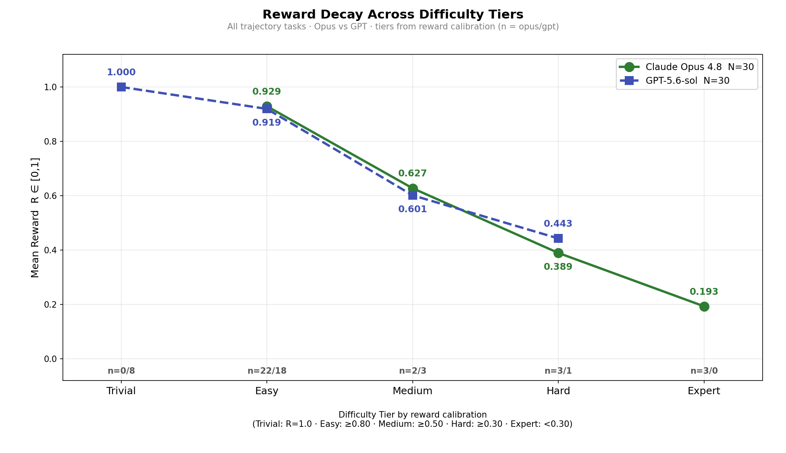
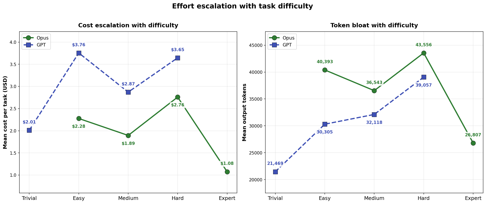

<p align="center">
  
</p>

<p align="center">
  <strong>Raiden Samples: agentic-coding RL environments for building stateful CLIs from a prose spec, verified end-to-end.</strong>
</p>

<p align="center">
  <a href="#summary"></a>
  
  
  
  
</p>

<p align="center"><sub>
  <a href="#summary">Summary</a> · <a href="#whats-in-the-box">Contents</a> · <a href="#repository-layout">Layout</a> · <a href="#per-sample-structure">Sample structure</a> · <a href="#results">Results</a> · <a href="#coverage">Coverage</a> · <a href="#reproduction">Reproduction</a>
</sub></p>

# Raiden Samples: 30 Verified RL Environments for Stateful CLI Implementation

**Raiden measures whether an agent can build a stateful CLI application from a prose spec, not
just patch an isolated bug.** Each task drops the agent into a containerized workspace, hands it
an `instruction.md`, hides the test suite, and grades the resulting submission on the fraction of
end-to-end tests that pass. Where SWE-style benchmarks patch a single issue in an existing
codebase, Raiden targets **full implementation from scratch** of a real CLI contract (argument
dispatch, wire semantics, output shape, error / exit-code behavior, and cross-command state
persistence), scored on a continuous reward built for RL training.

This is a curated **30-task** sample spanning a **Kubernetes** CLI (`kubectl` against a kwok
control plane) and **six AWS service families** (DynamoDB, KMS, SQS, Cognito, S3, Kinesis). Every
task is paired with the complete agent trajectories of **two frontier models** (**Claude Opus
4.8** and **GPT-5.6**) at 1 run per model, for **60 graded runs** in total. Each run carries the
full output of the **Raiden verifier**: a deterministic legitimacy gate, an LLM-judged rubric, and
a **held-out test suite run against the agent's own solution**.

> **This is a representative, quality-controlled sample of the full Raiden corpus,** provided for
> review. The task format (Harbor), the trajectory format (ATIF), and the scoring are
> identical to the production RL-training deliveries.

## Summary

| Property             | Value                                                                                 |
| :------------------- | :------------------------------------------------------------------------------------ |
| Tasks                | **30**: 10 Kubernetes (kubectl / kwok) + 20 AWS (DynamoDB, KMS, SQS, Cognito, S3, Kinesis) |
| Graded runs          | **60** (2 models × 30 tasks × 1 run; full grid, no gaps)                               |
| Policy models        | `claude-opus-4-8`, `gpt-5.6-sol`                                                       |
| Shipped tests        | **6,852** hidden end-to-end tests across the corpus                                    |
| Simulation backends  | kwok, DynamoDB Local, local-kms, ElasticMQ, cognito-local, MinIO, kinesalite          |
| Reward               | continuous `passed / (passed + failed + errors) ∈ [0, 1]`; collection-drift → 0       |
| Gate outcome         | **60 / 60 runs `accept`**, **30 / 30 datasets `accept`**                               |

**Mean reward on this sample** (the authoritative outcome, fraction of the hidden suite that passed):

| Metric                              |  Value | Range          |
| :---------------------------------- | -----: | :------------- |
| GPT-5.6 **mean reward**             | 0.8932 | 0.443 – 1.000  |
| Claude Opus 4.8 **mean reward**     | 0.7814 | 0.115 – 0.992  |
| Held-out pass-rate **mean** (n=60)  | 0.7755 | 0.000 – 1.000  |

## What's in the box

Each of the 30 samples is a fully self-contained RL environment bundling three things:

- the **task definition** an agent solves (spec, pinned Docker image, hidden test suite, oracle);
- the **recorded trajectories** of both models solving it (full action / observation logs);
- the **Raiden verifier output** for each run: the gate verdict, the LLM-judge rubric verdicts,
  and the **held-out pytest results** produced by rebuilding each model's solution and running a
  freshly-authored test suite against it.

## Repository layout

```
raiden-samples/
├── README.md                 # this document
├── LICENSE                   # MIT (© Ethara.AI 2026)
└── <uuid>/                   # 30 self-contained task directories
```

Unlike a split `dataset/` + `trajectories/` layout, **each task is one self-contained `<uuid>/`
directory** that carries its own definition, both models' runs, and every verifier artifact:

```
<uuid>/
  TRUTH.md                     path-agnostic behavioral contract (authored from the spec)
  instruction.md  task.toml    the task definition (Harbor schema, image pinned @sha256)
  environment/                 Dockerfile + docker-compose (pinned image, network-isolated)
  solution/                    golden.diff, reference.diff, solve.sh (the oracle)
  tests/
    conftest.py  test.sh       the shipped harness (backend boot + reward parser v2)
    __init__.py                marks tests/ as a package for collection
    _ddb_http.py / _s3_http.py stdlib-only wire client (DynamoDB / S3 families only)
    test_<...>.py              the hidden graded suite (the frozen tests)
    rubrics.json               the LLM-judge contract (rubric criteria)
    test_outputs.py            held-out frozen tests authored from TRUTH.md (overfit probe)
  trajectories/<model>/run_1/          # model ∈ {claude-opus-4-8, gpt-5.6-sol}
    agent/                     trajectory.json, run_agent.py, openhands_sdk.txt,
                               result.json, config.json
    verifiers/
      report.json              THE verdict: gate (accept/quarantine) + graded process score
      pytest_results.json      HELD-OUT: test_outputs.py run against THIS model's solution
      rubric_results.json      LLM-judge verdicts, evidence-cited
      atif_verifier/           the graded outputs: results.xml, reward.txt, test-stdout.txt
```

Every `<uuid>/` follows this exact layout. The only per-family variation is the required wire
helper (`tests/_ddb_http.py` for DynamoDB, `tests/_s3_http.py` for S3) that the shipped
`conftest.py` imports.

## Per-sample structure

**Dataset (the task).** `instruction.md` is the full behavioral spec the agent receives.
`task.toml` carries the Harbor metadata (declared commands, behaviour-tag counts, `tests_shipped`,
the digest-pinned image, the simulation backend). `environment/` builds a network-isolated
container on the pinned image; `solution/` holds the oracle (`golden.diff` preferred, else
`reference.diff`, applied by `solve.sh`); `tests/` is the hidden graded suite plus a `conftest.py`
that boots the sandbox backend and enforces the anti-NOP / collection-drift guards. During a run
the agent sees only the built container filesystem and `instruction.md`; `solution/` and `tests/`
are used exclusively by the verifier and are never mounted into the agent's environment.

**Trajectories (how each model solved it).** `agent/trajectory.json` is the complete ATIF event
log: every reasoning step, tool call, and observation. `result.json` / `config.json` carry the
run's outcome, token / cost accounting, and configuration.

**Verifier output (how Raiden graded it).** `verifiers/report.json` carries the gate decision
(`accept` / `quarantine`) and a process `graded_score`; `pytest_results.json` holds the held-out
result; `rubric_results.json` the per-criterion LLM-judge verdicts; and `atif_verifier/` the
authoritative graded outputs (`results.xml`, `reward.txt`, `test-stdout.txt`).

## Results

Reward is the fraction of the hidden suite that passed (the authoritative outcome). *Held-out* is
the pass-rate of a **separately-authored** test suite run against each model's reconstructed
solution, a check on generalization beyond the visible tests.

| Family | Tasks | Shipped tests | Reward (Opus 4.8) | Reward (GPT-5.6) | Held-out (mean) |
|---|---:|---:|---:|---:|---:|
| Kubernetes (kubectl / kwok) | 10 | 3,875 | 0.78 | 0.79 | 0.54 |
| AWS DynamoDB | 8 | 876 | 0.60 | 1.00 | 0.96 |
| AWS KMS | 4 | 998 | 0.87 | 0.90 | 0.85 |
| AWS SQS | 3 | 488 | 0.91 | 0.93 | 0.91 |
| AWS Cognito | 2 | 392 | 0.85 | 0.85 | 0.76 |
| AWS S3 | 2 | 125 | 0.96 | 0.97 | 1.00 |
| AWS Kinesis | 1 | 98 | 0.94 | 0.95 | 0.54 |
| **Corpus** | **30** | **6,852** | **0.78** | **0.89** | **0.78** |

Reward spans the full range (Opus 0.115–0.992, GPT 0.443–1.000); low scores are legitimate
outcomes on hard subsets, not verifier failures. Because the reward is fractional per test rather
than all-or-nothing, partial progress on a long implementation stays visible in the RL signal even
when a strict `pass@1` would read zero. All 30 datasets and all 60 runs pass the deterministic +
Claude-judged gate.

### Reward decay across difficulty tiers

Stratifying the 60 runs into five tiers **by observed reward** (Trivial `R=1.0` · Easy `≥0.80` ·
Medium `≥0.50` · Hard `≥0.30` · Expert `<0.30`) shows a clean monotone decay for both models: the
corpus contains genuinely costly work, not just easy wins.



The two curves cross in the hard band (GPT holds 0.443 on Hard where Opus falls to 0.389, and Opus
is the only model with runs in the Expert tier at 0.193) but track closely elsewhere. The per-tier
run counts (`n = opus/gpt`) are Trivial 0/8, Easy 22/18, Medium 2/3, Hard 3/1, Expert 3/0; the
tier-weighted means reconcile exactly to the corpus figures: **Opus 4.8 = 0.781**, **GPT-5.6 =
0.893** across all 30 tasks each.

### Effort escalation: cost and tokens by tier

Difficulty shows up in the accounting, not just the score: harder tiers cost more dollars **and**
burn more output tokens for both models, peaking at the Hard tier before the low-`n` Expert /
Trivial ends taper off. Values below are per-run means from each run's `agent/result.json`
(`cost_usd`, `n_output_tokens`), binned by the same reward tiers.



| Tier | Cost Opus | Cost GPT | Tokens Opus | Tokens GPT |
|---|---:|---:|---:|---:|
| Trivial | n/a | $2.01 | n/a | 21,469 |
| Easy | $2.28 | $3.76 | 40,393 | 30,305 |
| Medium | $1.89 | $2.87 | 36,543 | 32,118 |
| Hard | $2.76 | $3.65 | 43,556 | 39,057 |
| Expert | $1.08 | n/a | 26,807 | n/a |

GPT-5.6 spends **more dollars per task** than Opus in every shared tier (e.g. Hard $3.65 vs $2.76),
while Opus emits **more output tokens** (Hard 43,556 vs 39,057), a pricing-vs-verbosity split. As
in the reward figure, Trivial has GPT-only runs and Expert has Opus-only runs (`n = opus/gpt`:
0/8 · 22/18 · 2/3 · 3/1 · 3/0).

## Coverage

The sample covers a **Kubernetes** CLI surface plus **six AWS service families**. Kubernetes
carries the bulk of the hidden suite (3,875 of 6,852 tests) because `kubectl` against a kwok
control plane exercises the widest command grammar; the AWS families cover narrower but
wire-exact contracts (DynamoDB-JSON, KMS envelopes, SQS/Cognito/Kinesis actions, S3 REST + XML).
Each task implements a **subset** of its surface's command set, and the per-task subset size drives
the reward-granularity design.

| Family                       | Tasks | Backend            | Shipped tests |
| :--------------------------- | ----: | :----------------- | ------------: |
| Kubernetes (kubectl / kwok)  |    10 | kwok               |         3,875 |
| AWS DynamoDB                 |     8 | DynamoDB Local     |           876 |
| AWS KMS                      |     4 | local-kms          |           998 |
| AWS SQS                      |     3 | ElasticMQ          |           488 |
| AWS Cognito                  |     2 | cognito-local      |           392 |
| AWS S3                       |     2 | MinIO              |           125 |
| AWS Kinesis                  |     1 | kinesalite         |            98 |
| **Total**                    | **30** |                   |     **6,852** |

## Reproduction

The reward and full diagnostics for every run are already shipped under
`<uuid>/trajectories/<model>/run_1/`. No re-execution is needed to read them.

```python
import json, glob, collections, statistics as st
by_model = collections.defaultdict(list)
for rp in glob.glob("*/trajectories/*/run_1/verifiers/atif_verifier/reward.txt"):
    model = rp.split("/")[2]                       # claude-opus-4-8 | gpt-5.6-sol
    by_model[model].append(float(open(rp).read().strip()))
for m, xs in sorted(by_model.items()):
    print(f"{m:16s} n={len(xs)} mean={st.mean(xs):.4f} "
          f"min={min(xs):.3f} max={max(xs):.3f}")
# -> claude-opus-4-8  n=30 mean=0.7814 min=0.115 max=0.992
# -> gpt-5.6-sol      n=30 mean=0.8932 min=0.443 max=1.000
```

To re-grade a task in Docker, build `<uuid>/environment/` (requires IAM access to the pinned base
image), bring up `docker-compose.yaml` to boot the simulation-backend sidecar, run
`solution/solve.sh` to apply the oracle, then `tests/test.sh` to score it; the container is
implementation-agnostic and only requires the built CLI on `$PATH`.

## Licensing

Released under the **MIT License** (© Ethara.AI 2026); see [`LICENSE`](LICENSE). The runtime
containers are *built on* private base images and a third-party agent SDK; the MIT grant on this
repository does not extend to those upstream artefacts.

---

<sub>Built by Ethara.AI.</sub>
