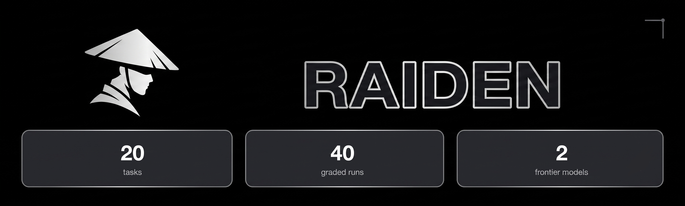
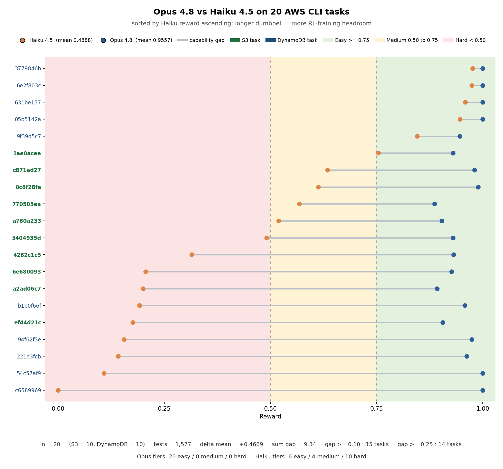
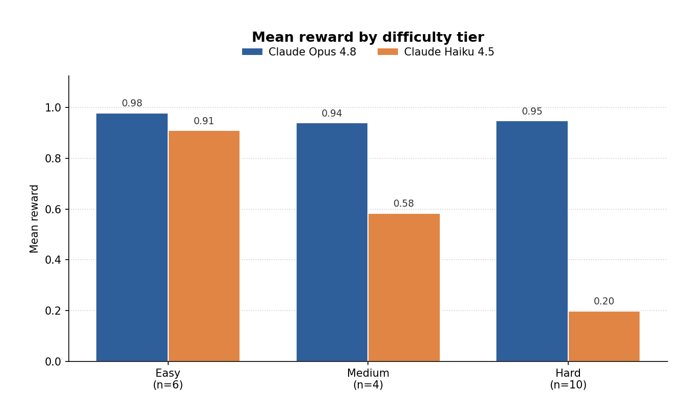
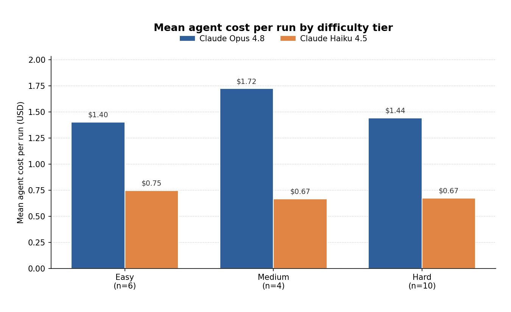
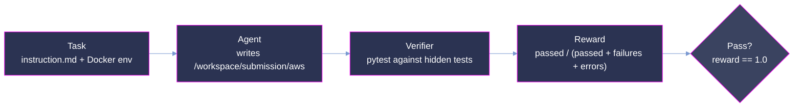

<p align="center">
  
</p>

<p align="center">
  <strong>Agentic-coding RL training environments for stateful CLI implementation, calibrated across a capability gap.</strong>
</p>

<p align="center">
  <a href="#summary"></a>
  <a href="#scoring-methodology"></a>
  <a href="#scoring-methodology"></a>
  <a href="#verification-and-quality-assurance"></a>
</p>

<p align="center"><sub>
  <a href="#summary">Summary</a> · <a href="#repository-layout">Layout</a> · <a href="#difficulty-tiers">Tiers</a> · <a href="#results-reward-vs-model-capability">Results</a> · <a href="#analysis">Analysis</a> · <a href="#coverage">Coverage</a> · <a href="#dataset-structure">Dataset</a> · <a href="#trajectory-structure">Trajectories</a> · <a href="#scoring-methodology">Scoring</a> · <a href="#reproduction">Reproduction</a> · <a href="#verification-and-quality-assurance">Verification</a>
</sub></p>

# Raiden Samples: 20-Task AWS CLI Evaluation Sample

**Raiden measures whether an agent can build a stateful CLI application from a prose spec, not
just fix an isolated bug.** Each task drops the agent into a containerized workspace, hands it an
`instruction.md`, hides the test suite, and grades the resulting submission on the fraction of
end-to-end tests that pass. Where SWE-style benchmarks patch a single issue in an existing
codebase, Raiden targets full implementation from scratch of a real CLI contract (argument
parsing, wire semantics, error and exit-code contract, and cross-command state persistence),
scored on a continuous reward that supports RL training and evaluation.

This is a curated **20-task** sample from Raiden, split across two AWS CLI service families
(`aws s3` and `aws dynamodb`). Each task is paired with the complete agent trajectories of two
frontier models (Claude Opus 4.8 and Claude Haiku 4.5) at 1 run per model, for **40 graded runs**
in total, each scored by the same `test.sh` verifier the training consumer uses.

Tasks are stratified into three difficulty tiers (Easy, Medium, Hard), calibrated from observed
Haiku reward on this sample, and cover 15 distinct AWS CLI commands across 2 service surfaces.

The per-task reward gap between the two models grows sharply as task difficulty rises: Opus 4.8
stays near the ceiling on every task while Haiku 4.5 spreads across the full `[0, 1]` range. See
[Results](#results-reward-vs-model-capability) for the tier-level breakdown.



> **This is a representative, quality-controlled sample of the full Raiden corpus,** provided for
> evaluation. The task format ([Harbor 0.13.1](https://github.com/harbor-framework/harbor)),
> trajectory format, and scoring are identical to the production RL-training deliveries.

## Summary

| Property             | Value                                                                              |
| :------------------- | :--------------------------------------------------------------------------------- |
| Tasks                | **20** (S3 10 / DynamoDB 10)                                                       |
| Difficulty tiers     | 3, by **observed Haiku reward** (Easy ≥ 0.75, Medium 0.50–0.75, Hard < 0.50)       |
| Models evaluated     | Claude Opus 4.8, Claude Haiku 4.5                                                  |
| Runs & grid          | 1 per model (pass@1) = 2 per task, 40 total; full 2 × 1, no gaps                   |
| Reward               | continuous `passed / total ∈ [0, 1]`, per run in `verifier_result.rewards.reward`  |
| Held-out tests       | **1,577** total (S3 626 / DynamoDB 951)                                            |
| Service surfaces     | 2 (`aws s3`, `aws dynamodb`) covering 15 unique CLI commands                       |
| Simulation backends  | MinIO (S3, session-scoped), DynamoDB Local (`sha256`-pinned sidecar)               |
| Format               | [Harbor 0.13.1](https://github.com/harbor-framework/harbor)                        |

**Mean reward on this sample** (see [Scoring methodology](#scoring-methodology) for how the reward
is defined):

| Metric                           |  Value |
| :------------------------------- | -----: |
| Claude Opus 4.8 **mean reward**  | 0.9557 |
| Claude Haiku 4.5 **mean reward** | 0.4888 |
| **Capability gap (Δmean)**       | +0.4669 |
| Claude Opus 4.8 **pass@1**       |  30.0% |
| Claude Haiku 4.5 **pass@1**      |   0.0% |

## Repository layout

```
raiden-samples/
├── README.md                 # this document
├── LICENSE                   # MIT (Ethara.AI 2026)
├── REQUIREMENTS.md           # the pilot requirements this repo satisfies
├── make_plot.py              # regenerates all charts under assets/ from dataset/ + trajectories/
├── assets/                   # figures
│   ├── hero.png              # README banner
│   ├── opus_vs_haiku.png     # per-task reward dumbbell chart (Opus vs Haiku, 20 tasks)
│   ├── reward_by_tier.png    # per-tier mean reward bar chart (Easy / Medium / Hard)
│   └── cost_by_tier.png      # per-tier mean agent cost per run bar chart (USD)
├── dataset/                  # task definitions, one directory per UUID (20)
│   └── <uuid>/ ...
└── trajectories/             # model runs, one directory per UUID (20)
    └── <uuid>/<model>/run_N/ ...   # model ∈ {claude-opus-4-8, claude-haiku-4-5}; N ∈ {1}
```

Task UUIDs match **1:1** between `dataset/` and `trajectories/` (20 each). Under each task, both
models appear as `<model>/` directories, each containing exactly one `run_1/` sample with the full
runtime evidence (agent trajectory, verifier reward + XML, config, artifacts manifest).

The service scope of each task is not encoded in the directory path; it is recorded in the task's
`task.toml.metadata.keywords` (`aws_cli_s3` vs `aws_cli_dynamodb`). One-liner to list them:

```bash
grep -l aws_cli_s3       dataset/*/task.toml | xargs -n1 dirname | xargs -n1 basename   # 10 S3
grep -l aws_cli_dynamodb dataset/*/task.toml | xargs -n1 dirname | xargs -n1 basename   # 10 DDB
```

## Difficulty tiers

The 20 tasks are stratified into three tiers by **observed Haiku 4.5 reward** on this sample:
how much of each task's E2E suite the weaker calibration model passes. The Opus 4.8 candidate
saturates the sample (all 20 tasks land in the Easy band for Opus), so Haiku carries the
discriminative signal for tier assignment. This is an **outcome-based** stratification computed
from the runs shipped here, so the tiers describe what a mid-tier model actually experienced
rather than any property fixed in advance.

Thresholds (fixed): **Easy ≥ 0.75**, **Medium 0.50–0.75**, **Hard < 0.50**.



| Tier       |   n | mean Haiku reward | mean Opus reward |
| :--------- | --: | ----------------: | ---------------: |
| **Easy**   |   6 |            0.9093 |           0.9792 |
| **Medium** |   4 |            0.5837 |           0.9401 |
| **Hard**   |  10 |            0.1985 |           0.9479 |

## Results: reward vs model capability

The reward is a continuous scalar `passed / total ∈ [0, 1]`, written by `tests/test.sh` to
`/logs/verifier/reward.txt` and copied into
`trajectories/<uuid>/<model>/run_N/result.json` at `verifier_result.rewards.reward`. Because the
reward is fractional per test rather than all-or-nothing, partial progress on a long
implementation stays visible even when the strict `pass@1` (reward exactly 1.0) is 0.

**Per-tier pass@1 by model** (fraction of each model's runs in the tier that scored exactly 1.0):

| Tier (n)    | Claude Opus 4.8 | Claude Haiku 4.5 |
| :---------- | --------------: | ---------------: |
| Easy (6)    |           66.7% |             0.0% |
| Medium (4)  |            0.0% |             0.0% |
| Hard (10)   |           20.0% |             0.0% |

**Per-tier mean reward by model** (partial credit in `[0, 1]`):

| Tier (n)    | Claude Opus 4.8 | Claude Haiku 4.5 |
| :---------- | --------------: | ---------------: |
| Easy (6)    |          97.9%  |            90.9% |
| Medium (4)  |          94.0%  |            58.4% |
| Hard (10)   |          94.8%  |            19.9% |

**Per-service breakdown:**

| Scope      |  n | mean Opus | mean Haiku | median Haiku | Haiku min | Haiku max |
| :--------- | -: | --------: | ---------: | -----------: | --------: | --------: |
| S3         | 10 |    0.9275 |     0.4477 |       0.5052 |    0.1757 |    0.7544 |
| DynamoDB   | 10 |    0.9839 |     0.5299 |       0.5185 |    0.0000 |    0.9762 |
| **Total**  | 20 |    0.9557 |     0.4888 |       0.5052 |    0.0000 |    0.9762 |

With 20 tasks across three tiers, these are an average tendency on a small, curated sample rather
than a precise law.

In contrast, inference cost stays close to flat across tiers, with the Medium tier the priciest
for both models — the harder tasks are not proportionally more expensive because the smaller
model's rollouts fail fast and the stronger model saturates on iteration count regardless of tier.



## Analysis

Raiden asks a different question than issue-resolution benchmarks. SWE-bench-style tasks measure
whether a model can localize and patch an existing codebase; Raiden measures whether it can build
a real stateful CLI from a prose spec, containerized, with the grader hidden. The two AWS surfaces
(S3 REST + XML and DynamoDB-JSON with condition-expression / key-condition grammar) are
non-trivial to reproduce end-to-end, so the reward reflects genuine implementation rather than
recall. Because the harness never shows the tests to the model, a policy cannot overfit the
grader; it must satisfy the underlying service semantics.

Capability separation on this sample is large: mean Opus 4.8 reward is **0.9557**, mean Haiku 4.5
reward is **0.4888**, for a **Δmean of +0.4669**. Opus 4.8 saturates the sample (all 20 tasks land
in the Easy band, mean reward ≥ 0.94 in every tier), while Haiku 4.5 spreads across tiers with a
clean gradient (Easy 0.91 · Medium 0.58 · Hard 0.20). The Hard tier compresses `pass@1` (Opus 20%
vs Haiku 0%) but preserves the difference at the mean-reward level (Opus 0.948 vs Haiku 0.199),
which is exactly what a continuous reward is for: it stays informative where a binary pass metric
would call both models identical.

The `pass@1` figure alone would flatten the picture. Haiku scores exactly `1.0` on **zero** of 20
tasks (its pass@1 is 0.0% overall), yet its mean reward is 0.49; that partial-progress mass is
what an RL signal needs. Opus scores exactly `1.0` on 6 of 20 (30.0% pass@1), so its remaining
headroom is also visible without any tie-breaking. If we had only used `pass@1`, we would have
called Haiku a floor model on both S3 and DynamoDB; the fractional reward instead shows Haiku
already clearing >90% of the Easy tier and getting nothing on 2 of 10 hard tasks (Haiku ≤ 0.11,
including one exact zero on `c6589969` where Opus scores 1.0).

DynamoDB is easier for both models than S3 (mean Opus 0.98 vs 0.93; mean Haiku 0.53 vs 0.45),
which is consistent with the reward-granularity design: the DynamoDB task suites have more tests
per task (avg 95 vs 63), so per-test weight is smaller and small implementation errors move the
score less. On both surfaces, the largest per-task gaps cluster on the Hard-for-Haiku tasks and
carry the RL-training signal.

Cost complements these results: Opus 4.8 spends roughly **2× more per run** than Haiku 4.5
(mean $1.49 vs $0.69 across the sample) for its **+0.47 reward advantage**. The Medium tier is
the priciest for both models ($1.72 Opus / $0.67 Haiku); the Hard tier is not proportionally more
expensive because Haiku's rollouts fail fast on tasks it cannot solve and Opus saturates on
iteration budget regardless of task difficulty. On a cost-per-point-of-reward basis, Opus is the
more efficient choice for Medium and Hard tiers where Haiku's rewards collapse, while Haiku is
competitive on Easy tasks where both models land near the ceiling.

These separations are trustworthy only because the grading harness cannot be gamed: the agent
never sees `tests/` or `solution/`, every container pins ~30 external hostnames to `0.0.0.0`, a
`socket.connect` guard raises on any non-loopback / non-private connect, and `test.sh` always
exits `0` so the exit code cannot be used as a signaling channel. A model's reward reflects the
CLI it built, not an answer it fetched from the network.

## Coverage

The sample covers **2 service surfaces** and **15 unique AWS CLI commands** (7 S3 + 8 DynamoDB).
Each task implements a **subset** of its surface's full command set; per-task subset sizes and
the number of tests they generate are what drive the reward-granularity design.

| Service     | Tasks | Commands covered                                                                | Command subset sizes           |     Tests |
| :---------- | ----: | :------------------------------------------------------------------------------ | :----------------------------- | --------: |
| `aws s3`    |    10 | `mb, rb, cp, ls, mv, rm, sync` (7)                                              | 5 (× 9),  7 (× 1)              |       626 |
| `aws dynamodb` | 10 | `create-table, delete-item, delete-table, get-item, list-tables, put-item, query, update-item` (8) | 5 (× 2), 6 (× 4), 7 (× 2), 8 (× 2) |       951 |
| **Total**   |    20 | **15 unique CLI commands** across 2 surfaces                                     |                                |     1,577 |

**Per-command task frequency** (how many tasks include each command in their subset):

| Command (S3) | Tasks || Command (DynamoDB) | Tasks |
| :----------- | ----: |:-|:------------------ | ----: |
| `cp`         |    9  || `delete-item`      |   10  |
| `sync`       |    9  || `get-item`         |   10  |
| `mb`         |    8  || `list-tables`      |   10  |
| `mv`         |    8  || `delete-table`     |    8  |
| `rm`         |    7  || `query`            |    8  |
| `ls`         |    6  || `update-item`      |    8  |
| `rb`         |    5  || `create-table`     |    5  |
|              |       || `put-item`         |    5  |

## Dataset structure

Each task lives under `dataset/<uuid>/` and is fully self-contained:

```
dataset/<uuid>/
├── task.toml                 # metadata (keywords, commands, tests_shipped, image digest, runtime)
├── instruction.md            # the prompt presented to the agent
├── environment/
│   ├── Dockerfile            # builds the task image on the pinned per-scope base
│   └── docker-compose.yaml   # boots the simulation-backend sidecar (MinIO or DynamoDB Local)
├── solution/
│   ├── reference.diff        # the reference oracle patch
│   ├── golden.diff           # an alternative golden patch (preferred by solve.sh)
│   └── solve.sh              # applies the selected patch and wires up submission/aws
└── tests/
    ├── __init__.py           # marks tests/ as a package for pytest collection
    ├── _s3_http.py / _ddb_http.py  # stdlib-only wire-protocol client for the fixtures
    ├── conftest.py           # anti-NOP guard, `cli` fixture, autouse backend-reset fixture
    ├── test.sh               # verifier entrypoint: runs pytest, writes reward.txt
    └── test_<...>.py         # per-command and cross-command E2E tests (hidden from the agent)
```

During a run the agent sees only the built container filesystem and `instruction.md`.
`solution/` and `tests/` are used exclusively by the verifier and are never mounted into the
agent's environment. The submission is language-agnostic: whatever the agent places at
`/workspace/submission/aws` (native binary, shebang-scripted file, or wrapper dispatching
underneath) is invoked by the harness as `aws <cli> <command> ...`.

## Trajectory structure

Each run lives under `trajectories/<uuid>/<model>/run_N/`:

```
trajectories/<uuid>/<model>/run_N/       # model ∈ {claude-opus-4-8, claude-haiku-4-5}; N ∈ {1}
├── result.json               # config, agent metrics, verifier reward + diagnostics
├── config.json               # the run configuration (agent, environment, verifier, timeouts)
├── agent/
│   ├── trajectory.json       # structured step-by-step trace of the agent's tool calls
│   ├── openhands_sdk.txt     # agent SDK stdout log
│   └── run_agent.py          # entry-point script the harness invoked
├── verifier/
│   ├── results.xml           # pytest JUnit XML report (per-test outcomes)
│   ├── reward.txt            # bare scalar reward as written by test.sh
│   └── test-stdout.txt       # captured pytest stdout
└── artifacts/
    └── manifest.json         # artifact manifest for the run
```

Key `result.json` fields: `verifier_result.rewards.reward` (continuous reward ∈ [0, 1]),
`verifier_result.status`, `agent_result` (token usage, iterations, episodes), and
`config.agent.model_name` (authoritative model id, e.g. `anthropic/claude-haiku-4-5`,
`anthropic/claude-opus-4-8`). The `task_checksum` at the top of each `result.json` fingerprints
the task directory content the run graded against, so the run is bound to a specific frozen task
version.

## Scoring methodology



The verifier (`tests/test.sh`) computes one scalar reward per run:

```
reward = round(passed / (passed + failures + errors), 4)
```

- **Numerator:** number of pytest cases that pass on the agent's submission.
- **Denominator:** `passed + failures + errors`. `skipped` / `xfail` / `deselected` are excluded
  by design so they neither help nor hurt.
- **Anti-NOP guard.** `tests/conftest.py::pytest_configure` calls `pytest.exit(returncode=1, …)`
  before any test collects if `/workspace/submission/aws` is absent or non-executable. No JUnit
  XML is emitted, so the parser in `test.sh` writes `reward = 0.0`. An empty `exit 0` stub also
  fails: the `error-invalid-args` behaviour class asserts `returncode != 0` on documented error
  paths, so a NOP submission still hits the floor.
- **Ceiling.** Every task ships a reference solution at `solution/reference.diff` that passes the
  full suite by construction, so `reward = 1.0` is attainable.
- **Deterministic grading.** pytest runs with `-p no:randomly`, `PYTHONHASHSEED=0`, `TZ=UTC`,
  `LC_ALL=C.UTF-8`, and an autouse fixture wipes simulation-backend state before and after every
  test. `test.sh` always exits `0`, regardless of pass/fail count, so the reward file is the
  grading channel, not the exit code.

Throughout this document, `pass@1` is the fraction of a model's runs where `reward == 1.0`. The
verifier is offline by construction: every image pins ~30 external hostnames (package indexes,
GitHub, AWS endpoints) to `0.0.0.0`, and a `socket.connect` guard in `conftest.py` raises on any
non-loopback / non-private connect, so a submission cannot reach a real service or fetch its own
oracle patch.

## Reproduction

Image-building, agent execution, and scoring are orchestrated by the **Harbor 0.13.1** harness.
The reward and full diagnostics for every run are already in
`trajectories/<uuid>/<model>/run_N/result.json`.

### Recompute the mean rewards yourself

No trajectory re-execution is needed. Read the shipped rewards directly:

```python
import json, glob, collections
by_model = collections.defaultdict(list)
for rd in glob.glob("trajectories/*/*/run_*/result.json"):
    r = json.load(open(rd))
    model = rd.split("/")[2]                # claude-opus-4-8 | claude-haiku-4-5
    by_model[model].append(float(r["verifier_result"]["rewards"]["reward"]))
for m, xs in sorted(by_model.items()):
    at1 = sum(1 for x in xs if x == 1.0) / len(xs)
    print(f"{m:22s} n={len(xs):2d}  mean={sum(xs)/len(xs):.4f}  pass@1={at1:.4f}")
# -> claude-haiku-4-5      n=20  mean=0.4888  pass@1=0.0000
# -> claude-opus-4-8       n=20  mean=0.9557  pass@1=0.3000
```

### Regenerate the charts

All three charts in this document (`assets/opus_vs_haiku.png`, `assets/reward_by_tier.png`,
`assets/cost_by_tier.png`) are generated from the shipped `dataset/` and `trajectories/`:

```bash
python3 make_plot.py                 # writes all three charts under assets/
python3 make_plot.py out.png         # or write only the dumbbell chart to a custom path
```

### Re-run a single task in Docker

Every task ships a self-contained `docker-compose.yaml` that boots the simulation backend as a
sidecar. The recipe is identical for S3 and DynamoDB tasks; only the task UUID differs:

```bash
UUID=<task-uuid>                     # pick any of the 20 UUIDs under dataset/
TASK="dataset/$UUID"

# 1. Build the image from the per-task Dockerfile (requires IAM access to the base image in ECR,
#    or substitute an equivalent local base). Tag it raiden-main so the override below picks it up.
docker build -t raiden-main "$TASK/environment/"

# 2. Bring up the sidecar + main container via compose, bind-mounting the task dir at /task.
docker compose \
  -f "$TASK/environment/docker-compose.yaml" \
  -f <(cat <<'YAML'
services:
  main:
    image: raiden-main
    working_dir: /workspace
    volumes:
      - ./TASK_DIR:/task:ro
      - ./LOGS_DIR:/logs
    command: bash -c "
      bash /task/solution/solve.sh &&
      bash /task/tests/test.sh &&
      cat /logs/verifier/reward.txt
    "
YAML
) run --rm main
# (Replace TASK_DIR / LOGS_DIR with real absolute paths before you run.)
```

`solve.sh` prefers `golden.diff`, falls back to `reference.diff` (controlled by
`SOLVE_PATCH=golden|reference|auto`). Substitute the agent's submission for `solve.sh` to grade
an alternative implementation; the container is implementation-agnostic and only requires an
`aws` executable on `$PATH`.

## Verification and quality assurance

This sample passed a QC gate prior to delivery:

- **Structure.** 20 dataset directories and 20 trajectory directories per model, matched 1:1 by
  UUID; required files present and non-empty in every task and every run; the full 2 × 1 grid
  (40 runs) is complete; each `result.json` links back to its `task_checksum`.
- **Reward integrity.** Every reward is read directly from a `result.json` and matches
  `passed / (passed + failures + errors)` computed from the JUnit XML the same `test.sh` writes;
  `config.agent.model_name` matches the trajectory's model directory.
- **Discriminative reward.** Every task ships a reference solution
  (`solution/reference.diff`) that scores exactly 1.0 on the shipped suite (ceiling attainable),
  and every task's `task.toml` carries `discriminative = true`. A naive empty / missing /
  non-executable stub scores exactly 0.0 (floor guaranteed by the anti-NOP guard), so the reward
  is strictly bounded and non-trivial for both extremes.
- **Reward-hacking resistance.** The agent is never shown `tests/` or `solution/`. Each container
  pins ~30 external hostnames (`pypi.org`, `github.com`, `s3.amazonaws.com`,
  `dynamodb.amazonaws.com`, package mirrors, cloud CLIs, …) to `0.0.0.0` at the container level;
  `tests/conftest.py` installs a `socket.connect` guard that raises on any non-loopback /
  non-private connect. **No run could have obtained its oracle from the network.**
- **Fair play.** The agent's process is `openhands-sdk v1.12.0` under `harbor 0.13.1` with
  `n_attempts=1` (pass@1), `n_concurrent_trials=4`, `max_iterations=1000`,
  `force_adaptive_thinking=true`, `LLM_REASONING_EFFORT=high`. The grading harness is byte-for-byte
  the shipped `tests/test.sh` on the `sha256`-pinned per-scope image; the same one every training
  consumer sees.
- **Hermetic execution.** No real AWS, no internet, no flaky time-dependent paths. `PYTHONHASHSEED=0`,
  `TZ=UTC`, `LC_ALL=C.UTF-8` are baked into every image. The DynamoDB Local sidecar is pinned by
  `sha256` (`amazon/dynamodb-local:2.5.4@sha256:cf8cebd061f988628c02daff10fdb950a54478feff9c52f6ddf84710fe3c3906`)
  and runs `-inMemory -sharedDb -port 8000`. The S3 backend is `MinIO` spawned session-scoped from
  `conftest.py`. An autouse fixture wipes backend state before and after every test.
- **Limitations.**
  - **Sample size.** 20 tasks (6 Easy, 4 Medium, 10 Hard) with 1 run per model; per-tier and
    per-service breakdowns are averages on small n with real run-to-run variance, not precise
    estimates.
  - **Two-model calibration.** The tier boundaries are anchored on a single mid-tier calibration
    model (Haiku 4.5); a different weaker model may reassign a task's tier by a few points.
  - **Contamination.** The `aws s3` and `aws dynamodb` CLIs are public; whether a specific
    subset appeared in a model's training data is unknown, so mean reward is not a
    contamination-free measure of difficulty.
  - **Model nondeterminism.** Even at `pass@1`, temperature and internal reasoning traces produce
    per-run variance not captured by a single trial.

**Licensing.** MIT (see [`LICENSE`](./LICENSE), copyright Ethara.AI 2026). The MIT terms cover
the contents of this repository (task specs, tests, reference solutions, harness code). The
runtime containers are *built on* private base images and a third-party agent SDK
(`Ethara-Ai/software-agent-sdk`); the MIT grant on this repository does not extend to those
upstream artefacts.
